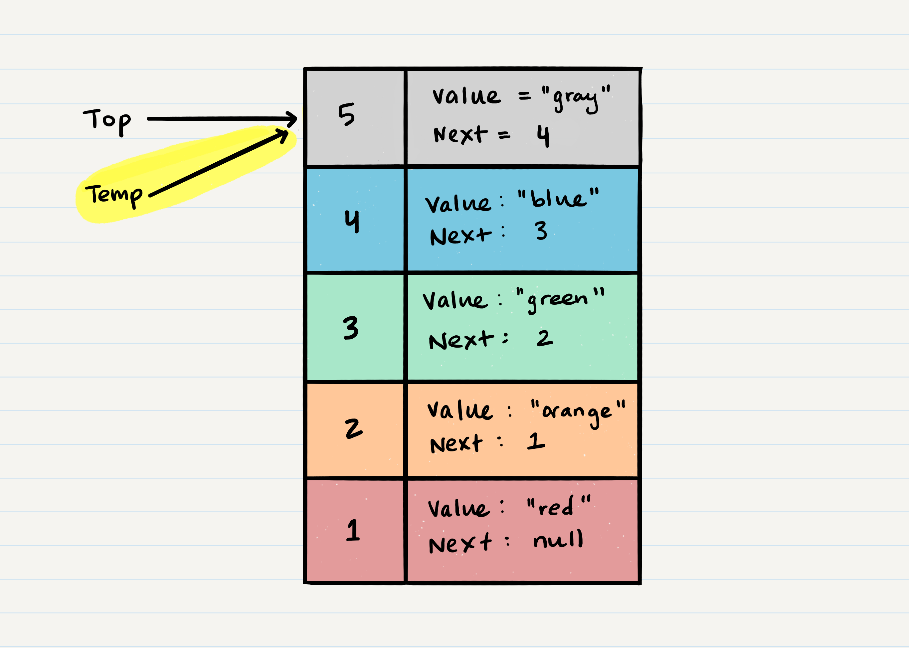

# Stacks & Queues
### FILO ```First In Last Out```
>This means that the first item added in the stack will be the last item popped out of the stack.

### LIFO ```Last In First Out```
>This means that the last item added to the stack will be the first item popped out of the stack.

## What is a Stack...

**Push** - Nodes or items that are put into the stack are pushed

**Pop** - Nodes or items that are removed from the stack are popped. When you attempt to pop an empty stack an exception will be raised.

**Top** - This is the top of the stack.

**Peek** - When you peek you will view the value of the top Node in the stack. When you attempt to peek an empty stack an exception will be raised.

**IsEmpty** - returns true when stack is empty otherwise returns false.


### Push O(1)
  *When adding a Node, you ```push``` it into the stack by assigning it as the new top, with its ```next``` property equal to the original ```top```.*


*Next, you need to assign the ```next``` property of ```Node 5``` to reference the same Node that ```top``` is referencing: ```Node 4```*


Technically at this point, your new Node is added to your stack, but there is no indication that it is the first Node in the stack. To make this happen, you have to re-assign our reference ```top``` to the newly added Node, ```Node 5```.


### Pop O(1)
*Popping a Node off a stack is the action of removing a Node from the top. When conducting a ```pop```, the ```top``` Node will be re-assigned to the Node that lives below and the top Node is returned to the user.*

*Typically, you would check isEmpty before conducting a pop. This will ensure that an exception is not raised or a try/catch block.*


*Once you have created the new reference type, you now need to re-assign ```top``` to the value that the ```next``` property is referencing. In our visual, we can see that the ```next``` property is pointing to ```Node 4```. We will re-assign ```top``` to be ```Node 4```.*


*We can now remove ```Node 5``` safely without it affecting the rest of the stack. Before we do that though you may want to make sure that you clear out the ```next``` property in your current ```temp``` reference. This will ensure that no further references to ```Node 4``` are floating around the heap. This will allow our garbage collector to cleanly and safely dispose of the Nodes correctly.*


*Finally, we return the value of the ```temp``` Node that was just popped off.*

```
Node temp <-- top
top <-- top.next
temp.next <-- null
return temp.value
```

### Peek O(1)
*When conducting a ```peek```, you will only be inspecting the ```top``` Node of the stack.*
```
ALGORITHM peek()
// INPUT <-- none
// OUTPUT <-- value of top Node in stack
// EXCEPTION if stack is empty

   return top.value
```

### IsEmpty O(1)
```
ALGORITHM isEmpty()
// INPUT <-- none
// OUTPUT <-- boolean

return top = NULL
```

## What is a Queue...
**Enqueue** - Nodes or items that are added to the queue.
**Dequeue** - Nodes or items that are removed from the queue. If called when the queue is empty an exception will be raised.
**Front** - This is the front/first Node of the queue.
**Rear** - This is the rear/last Node of the queue.
**Peek** - When you peek you will view the value of the front Node in the queue. If called when the queue is empty an exception will be raised.
**IsEmpty** - returns true when queue is empty otherwise returns false.


### Enqueue O(1)
*When you add an item to a queue, you use the **enqueue** action. This is done with an **O(1)** operation in time because it does not matter how many other items live in the queue **(n)**; it takes the same amount of time to perform the operation.*


First, we should change the ```next``` property of ```Node 4``` to point to the Node we are adding. In our case with the visual below, we will be re-assigning ```Node 4```’s .```next``` to ```Node 5```. The only way we have access to ```Node 4``` is through our reference ```rear```. Following the rules of reference types, this means that we must change ```rear.next``` to ```Node 5```.


After we have set the ```next``` property, we can re-assign the ```rear``` reference to point to ```Node 5```. By doing this, it allows us to keep a reference of where the ```rear``` is, and we can continue to enqueue Nodes into the queue as needed.


### Dequeue O(1)
When you remove an item from a queue, you use the **dequeue** action. This is done with an **O(1)** operation in time because it doesn’t matter how many other items are in the queue, you are always just removing the **front** Node of the queue.

The first thing you want to do is create a temporary reference type named ```temp``` and have it point to the same Node that ```front``` is pointing too. This means that ```temp``` will point to ```Node 1```


Next, you want to re-assign ```front``` to the ```next``` value that the Node ```front``` is referencing. In our visual, this would be ```Node 2```.


Now that we have moved ```front``` to the second Node in line, we can ```next``` re-assign the next property on the ```temp``` Node to null. We do this because we want to make sure that all the proper Nodes clear any unnecessary references for the garbage collector to come in later and clean up.

Finally, we return the value of the ```temp``` Node that was just removed.

```
ALGORITHM dequeue()
// INPUT <-- none
// OUTPUT <-- value of the removed Node
// EXCEPTION if queue is empty

   Node temp <-- front
   front <-- front.next
   temp.next <-- null

   return temp.value
```

### Peek O(1)
*When conducting a ```peek```, you will only be inspecting the ```front``` Node of the queue.*
```
ALGORITHM peek()
// INPUT <-- none
// OUTPUT <-- value of the front Node in Queue
// EXCEPTION if Queue is empty

   return front.value
```
### IsEmpty O(1)
```
ALGORITHM isEmpty()
// INPUT <-- none
// OUTPUT <-- boolean

return front = NULL
```

