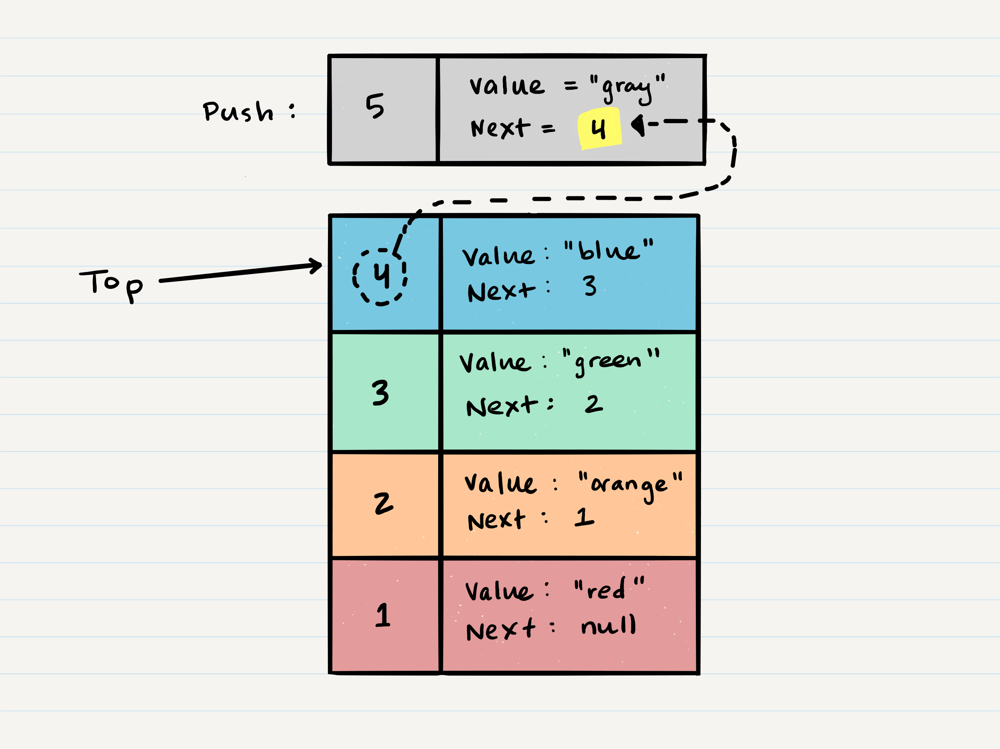

#  Stacks & Queues
  
  
**Push** - Nodes or items that are put into the stack are pushed
  
**Pop** - Nodes or items that are removed from the stack are popped. When you attempt to pop an empty stack an exception will be raised.
  
**Top** - This is the top of the stack.
  
**Peek** - When you peek you will view the value of the top Node in the stack. When you attempt to peek an empty stack an exception will be raised.
  
**IsEmpty** - returns true when stack is empty otherwise returns false.
  
###  FILO ```First In Last Out```
  
>This means that the first item added in the stack will be the last item popped out of the stack.
  
###  LIFO ```Last In First Out```
  
>This means that the last item added to the stack will be the first item popped out of the stack.
  

  
###  Push O(1)
  
  *When adding a Node, you ```push``` it into the stack by assigning it as the new top, with its ```next``` property equal to the original ```top```.*
  

  
*Next, you need to assign the ```next``` property of ```Node 5``` to reference the same Node that ```top``` is referencing: ```Node 4```*
  

  
Technically at this point, your new Node is added to your stack, but there is no indication that it is the first Node in the stack. To make this happen, you have to re-assign our reference ```top``` to the newly added Node, ```Node 5```.

  
###  Pop O(1)
  
*Popping a Node off a stack is the action of removing a Node from the top. When conducting a pop, the top Node will be re-assigned to the Node that lives below and the top Node is returned to the user.*
  
*Typically, you would check isEmpty before conducting a pop. This will ensure that an exception is not raised. Alternately, you can wrap the call in a try/catch block.*
  