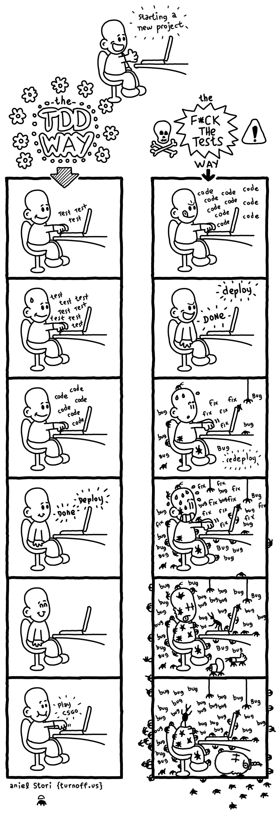

# TDD with Python
*Unit tests are some pieces of code to exercise the input, the output and the behaviour of your code*

***
### Example
```
def test_should_return_female_when_the_name_is_from_female_gender():
    detector = GenderDetector()
    expected_gender = detector.run(‘Ana’)
    assert expected_gender == ‘female’
```
Test Name - should return female when the name is from a female
Module Name - gender.py
File Nmae - test_gender.py
```
mymodule/
 — module.py
 — another_folder/
 — — another_module.py
tests/
 — test_module.py
 — another_folder/
 — — test_another_module.py
 ```

### The 3 A's
1. Arrange: you need to organize the data needed to execute that piece of code (input)
   - 🆘 Write a unit test and make it fail (it needs to fail because the feature isn’t there, right? If this test passes, call the Ghostbusters, really)
2. Act: here you will execute the code being tested (exercise the behaviour);
    - ✅ Write the feature and make the test pass! (you can dance after that)
3. Assert: after executing the code, you will check if the result (output) is the same as you were expecting
   - 🔵 Refactor the code — the first version doesn’t need to be the beautiful one (don’t be shy)

